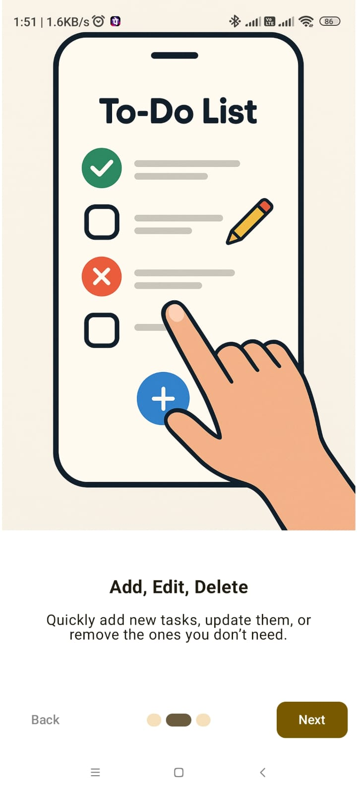
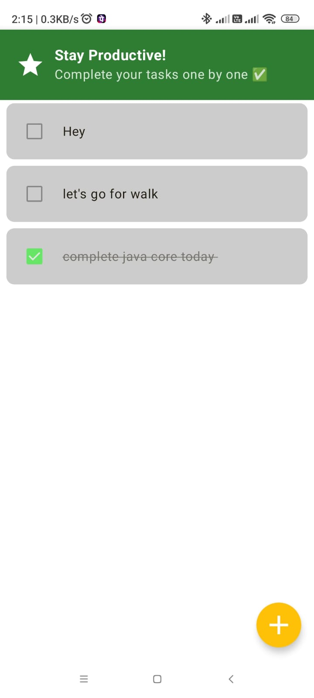
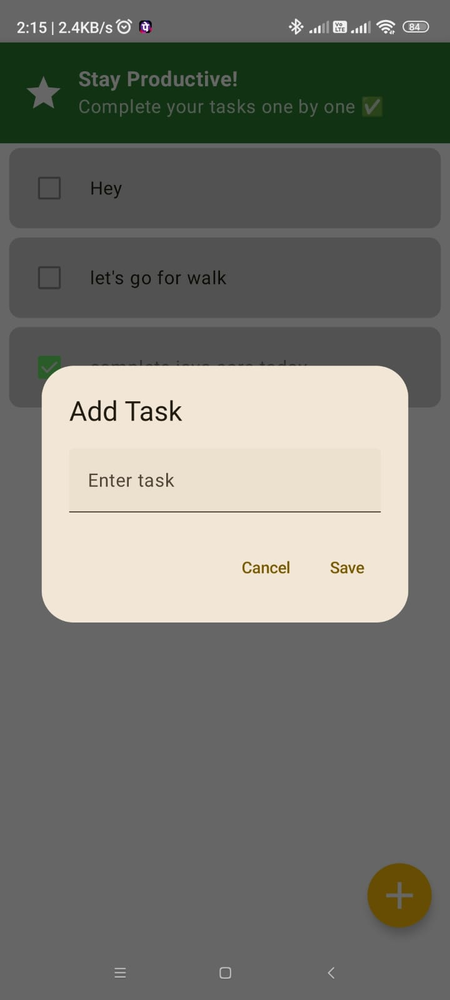
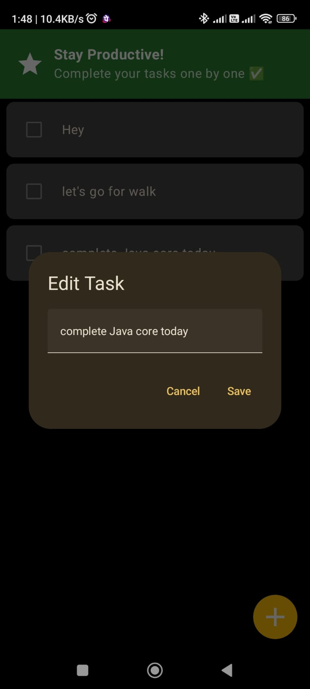
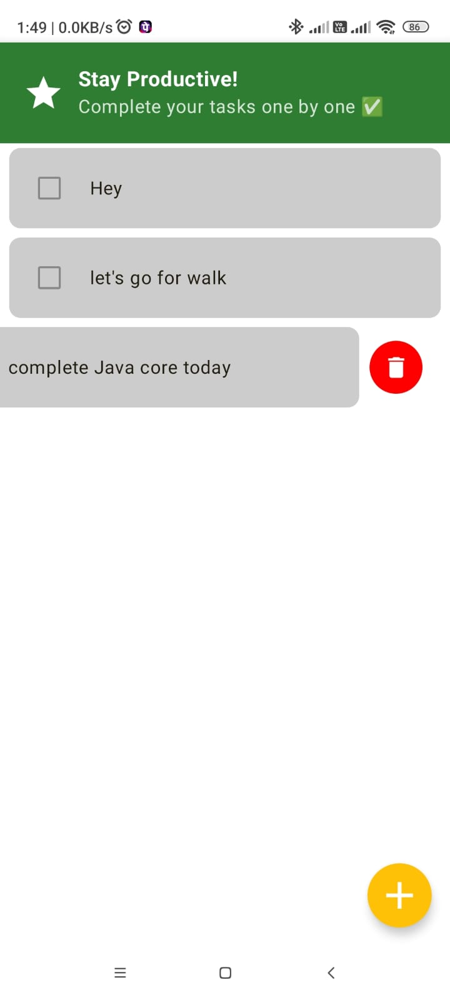

# ✅ TaskMate - Jetpack Compose To-Do App

TaskMate is a modern, minimal, and efficient to-do app built using **Jetpack Compose**, **Room Database**, and **MVVM architecture**. It helps you stay organized by managing your tasks with a clean and intuitive UI.

---

## 🚀 Features

- ✅ Onboarding screen for first-time users
- 📋 Add, edit, delete, and mark tasks as completed
- 🟢 Completed tasks move to the bottom automatically (sorted list)
- ✏️ Edit tasks anytime
- 🗑️ Swipe left to delete tasks with confirmation dialog
- 🎨 Strike-through & faded UI for completed tasks
- 🌙 Dark/Light Theme support with Material 3
- 💾 Offline persistence with Room database
- 📱 Built fully using Jetpack Compose

---

## 🛠 Tech Stack

| Layer         | Tools & Libraries                            |
|---------------|----------------------------------------------|
| UI            | Jetpack Compose, Material3                   |
| Architecture  | MVVM, StateFlow, ViewModel                   |
| Local Storage | Room Database                                |
| State Saving  | DataStore Preferences                        |

---

## 📱 Screenshots

### 🟣 Splash & Onboarding

<table>
  <tr>
    <td><b>Splash</b></td>
    <td><b>Onboarding 1</b></td>
    <td><b>Onboarding 2</b></td>
    <td><b>Onboarding 3</b></td>
  </tr>
  <tr>
    <td></td>
    <td></td>
    <td></td>
    <td></td>
  </tr>
</table>

---

### 🟢 Home & Add/Edit/Delete Tasks

<table>
  <tr>
    <td><b>Home</b></td>
    <td><b>Add Task</b></td>
    <td><b>Edit Task</b></td>
    <td><b>Delete Task</b></td>
  </tr>
  <tr>
    <td></td>
    <td></td>
    <td></td>
    <td></td>
  </tr>

</table>

---