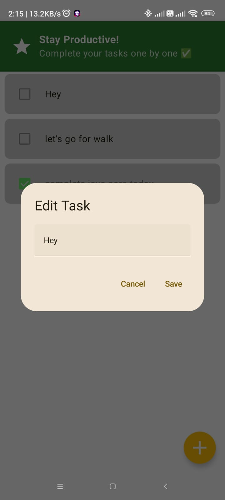

# TaskMate ✅
_A simple and modern task management app built with Jetpack Compose and MVVM_

## 📌 Overview
TaskMate is a productivity app that helps you stay organized by managing your daily tasks.  
It allows you to:
- Add new tasks
- Edit existing tasks
- Mark tasks as completed (with strike-through effect & faded UI)
- Delete tasks with swipe-to-dismiss
- Keep tasks sorted (pending tasks stay at the top, completed at the bottom)

The app is built entirely with **Jetpack Compose** and follows **MVVM architecture** using a **Room database** for persistent storage.

---

## 🛠️ Tech Stack
- **Kotlin**
- **Jetpack Compose** (UI)
- **ViewModel & StateFlow** (state management)
- **Room Database** (local storage)
- **Material 3 Components** (modern UI)
- **Swipe to Dismiss** API (for deleting tasks)

---

## 🚀 Features
- ✨ Modern UI with Material 3 & dark mode support
- 📋 Add, edit, delete, and update tasks easily
- ✅ Checkbox to mark tasks as completed (with green highlight)
- 🔄 Sorted list: completed tasks automatically move to the bottom
- 🗑️ Swipe left to delete tasks with a confirmation dialog
- 🎨 Theming: Light & Dark theme compatibility

---

## 📸 Screenshots

### Splash Screen

### Onboarding

### Home Screen

### Add Task

### Edit Task

### Delete Task

